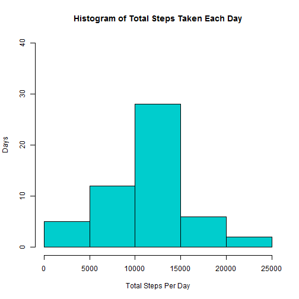
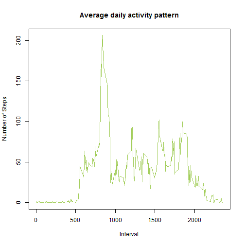
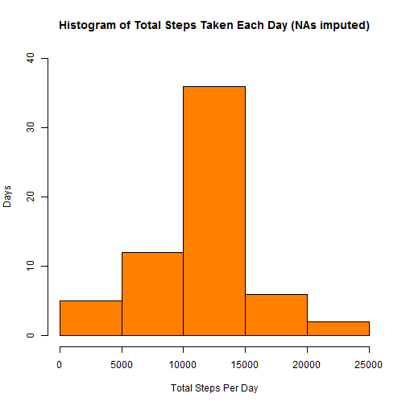

# Reproducible Research: Peer Assessment 1


## Loading and preprocessing the data
This data is forked from [the github repository](https://github.com/rdpeng/RepData_PeerAssessment1) for the Coursera Reproducible Research course.  This repository includes the data itself.  This processing file assumes you have downloaded the <i>activity.zip</i> data file, and it resides in your working directory.

To load and pre-process the data the following steps are taken:
* <i>activity.zip</i> is unzipped if necessary (if the data file is not in the working directory).
* The data from <i>activity.csv</i> is read into a data frame called <i>activity</i>.

```r
library(lattice)

if (!file.exists("activity.csv")) {
    unzip("activity.zip")
}

activity <- read.csv("activity.csv")
```


## What is mean total number of steps taken per day?
To determine the mean total number of steps taken per day, the following steps are taken.
* A subset of <i>activity</i> called <i>clnActivity</i> is created that does not contain NAs.
* The daily sum (excluding NAs) of steps taken is calculated using tapply(), and stored in <i>dailySteps</i> as a array.
* A histogram of the daily sums in <i>dailySteps</i> is created.
* The overall mean of the <i>dailySteps</i> array is taken to find the mean total number of steps taken per day.
* The median() function is also used to determine the median total number of steps taken per day.

```r
clnActivity <- droplevels(activity[complete.cases(activity), ])

dailySteps <- tapply(clnActivity$steps, clnActivity$date, sum)

hist(dailySteps, col = "cyan3", main = "Histogram of Total Steps Taken Each Day", 
    ylim = c(0, 40), xlab = "Total Steps Per Day", ylab = "Days")
```

 


### Mean total number of steps taken per day

```r
mn <- mean(dailySteps)
```

The mean total number of steps taken per day is <b>1.0766 &times; 10<sup>4</sup></b>.

### Median total number of steps taken per day

```r
mdn <- as.numeric(median(dailySteps))
```

The median total number of steps taken per day is <b>1.0765 &times; 10<sup>4</sup></b>.


## What is the average daily activity pattern?
The average daily activity pattern is examined by determining the number of steps taken over each interval, averaged across all days.  This is done in several steps:
* The mean across days of the steps taken is found for each interval using tapply() and stored in an array called <i>intrvlSteps</i>.
* The resulting average number of steps taken at each interval stored in <i>intrvlSteps</i> is plotted in a time series plot.
* The interval that, on average across days, has the greatest number of steps is determined by using the max() function.

```r
intrvlSteps <- tapply(clnActivity$steps, clnActivity$interval, mean)

plot(rownames(intrvlSteps), intrvlSteps, type = "l", col = "darkolivegreen3", 
    main = "Average daily activity pattern", xlab = "Interval", ylab = "Number of Steps")
```

 


### 5-minute interval that, on average across all days in the dataset, contains the maximum number of steps

```r
maxInt <- names(intrvlSteps[intrvlSteps == max(intrvlSteps)])
```

The interval that, on average across all days in the data set, contains the maximum number of steps is <b>interval 835</b>.


## Imputing missing values
Missing values for the number of steps are imputed by inserting the average steps across all days for that particular interval.  The steps to execute this process are:
* Calculate the number of missing values in the data set
* A new data frame called <i>intrvlMeans</i> based on the <i>intrvlSteps</i> array is created.
* <i>intrvlMeans</i> is merged with the <i>activity</i> data set in the <i>interval</i> variable, to create a new column called <i>avgMeans</i> and a new data set that includes the <i>avgMeans</i> called <i>impActivity</i>
* <i>impActivity</i> is ordered by date and interval
* Where the <i>steps</i> variable is 'NA', the average number of steps for that interval is copied from the <i>avgSteps</i> variable.
* Extra variables are removed from <i>impActivity</i> and column names are added so the format matches <i>activity</i>
* The daily sum (including imputed replacement values for NAs) of steps taken is calculated using tapply(), and stored in <i>impDailySteps</i> as an array.
* A histogram of the daily sums in <i>impDailySteps</i> is created.
* The overall mean of the <i>impDailySteps</i> array is taken to find the mean total number of steps taken per day.
* The median() function is also used to determine the median total number of steps taken per day (using the <i>impDailySteps</i> data set).

### Numer of missing values in the dataset

```r
misVal <- table(complete.cases(activity), exclude = "TRUE")
```

The total number of missing values in the data set is <b>2304</b>.


```r
intrvlMeans <- data.frame(interval = names(intrvlSteps), avgSteps = as.numeric(intrvlSteps))
impActivity <- merge(activity, intrvlMeans, by = "interval")
impActivity <- impActivity[order(impActivity$date, impActivity$interval), ]

for (i in 1:nrow(impActivity)) {
    if (is.na(impActivity$steps[i])) {
        impActivity$steps[i] <- impActivity$avgSteps[i]
    }
}

impActivity <- data.frame(impActivity$steps, impActivity$date, impActivity$interval)

colnames(impActivity) <- c("steps", "date", "interval")
```

The new data set containing imputed values is <i><b>impActivity</b></i>.


```r
impDailySteps <- tapply(impActivity$steps, impActivity$date, sum)

hist(impDailySteps, col = "darkorange1", main = "Histogram of Total Steps Taken Each Day (NAs imputed)", 
    ylim = c(0, 40), xlab = "Total Steps Per Day", ylab = "Days")
```

 


### Mean total number of steps taken per day with imputed NAs

```r
impMn <- mean(impDailySteps)
```

The mean total number of steps taken per day with imputed NAs is <b>1.0766 &times; 10<sup>4</sup></b>.

### Median total number of steps taken per day with imputed NAs

```r
impMdn <- median(impDailySteps)
```

The median total number of steps taken per day with imputed NAs is <b>1.0766 &times; 10<sup>4</sup></b>.

### Difference in mean and median calculation methods

```r
mnDiff <- abs(mn - impMn)
mdnDiff <- abs(mdn - impMdn)
```

The differences in the mean and median using NA exclusion and NA imputation methods are minimal.

The difference between the NA Exclusion mean and the NA imputation mean is <b>0</b>.

The difference between the NA Exclusion median and the NA imputation median is <b>1.1887</b>.

Our plots show us that the imputed values data set has more values near the mean, as would be expected with this imputation method; but the impact of imputing missing data using this method on the estimates of the total daily number of steps is almost none.

## Are there differences in activity patterns between weekdays and weekends?
Differences between weekend and weekday activity patterns are examined by subsetting the data into these two groups and creating a time series plot of the two subsets for comparison.
* First, the date variable in the <i>impActivity</i> data coerced to POSIXlt.
* Then day of the week for that observation is determined using the days() function.
* Two separate data frames are created, one containing all weekday observations (<i>weekdays</i>) and one containing all weekend observations (<i>weekend</i>).
* The mean steps for each interval across days is then calculated for both, and stored in the arrays <i>wdIntrvlSteps</i> and <i>weIntrvlSteps</i>.
* Those arrays of means are used to create the data frames <i>wd</i> and <i>we</i>.
* Those data frames are combined using the rbind() function, to create the <i>wkSteps</i> data set.
* The lattice plotting system is then used to create a pair of time series plots showing the differences between weekday and weekend activity using <i>wkSteps</i>.

```r
impActivity$date <- strptime(as.character(impActivity$date), format = "%Y-%m-%d")

days <- weekdays(impActivity$date)
days[days == "Saturday" | days == "Sunday"] <- "weekend"
days[days != "weekend"] <- "weekday"

impActivity$day <- as.factor(days)

weekdays <- impActivity[impActivity$day == "weekday", ]
weekends <- impActivity[impActivity$day == "weekend", ]

wdIntrvlSteps <- tapply(weekdays$steps, weekdays$interval, mean)
weIntrvlSteps <- tapply(weekends$steps, weekends$interval, mean)

wd <- data.frame(interval = as.numeric(names(wdIntrvlSteps)), avgSteps = as.numeric(wdIntrvlSteps), 
    day = "weekday")
we <- data.frame(interval = as.numeric(names(weIntrvlSteps)), avgSteps = as.numeric(weIntrvlSteps), 
    day = "weekend")

wkSteps <- rbind(wd, we)

xyplot(avgSteps ~ interval | day, data = wkSteps, type = "l", layout = c(1, 
    2), xlab = "Interval", ylab = "Number of steps")
```

 

### Differences in activity patterns
Looking at the plots we can see that weekdays have a higher peak of activity, but weekends show a more consistent activity pattern over the course of the day.
